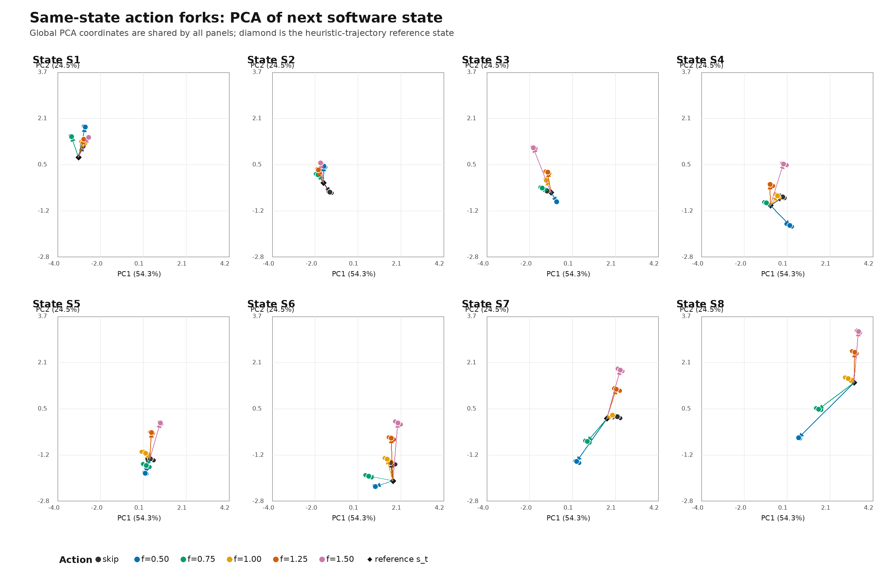
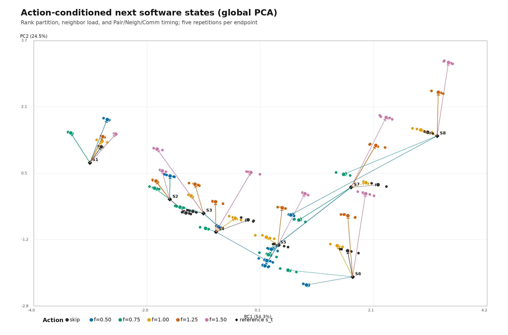

# 2026-10-07 amp2：Shock/NEMDの状態・行動特性調査

## 実験の位置づけ

- 実施日：2026-10-07（Asia/Tokyo）
- マシン：`amp2.g2.gsic.titech.ac.jp`（amp2）
- リポジトリブランチ：`rl-hpc-research`
- LAMMPS基準コミット：`c8bd2ae5927ee236a8892dbd51c18a92cc9c33cf`
- 本実験に関するコミット：`3be966cff1`、`20a1377d5f`

本実験では、同一のshock物理状態から行動を分岐し、次の2点を調べた。

1. balance actionによって次状態が変化するか
2. その状態遷移の影響が、将来の実行時間を変えるほど持続するか

これは方策学習の実験ではない。同一checkpointから複数actionへ分岐し、
`T(s,a)`とaction依存の状態遷移を直接測定する反実仮想実験である。

## 実行環境とworkload

amp2はIntel Xeon Gold 6240Rを2基、物理48 core、メモリ768 GBを搭載する。
GCC 15.2、Open MPI 5.0.10、およびMPI/SHOCK対応の専用LAMMPS build
`build_shock_char/lmp`を使用した。各試行はMPI 32 ranks、OpenMP 1 thread/rank
で実行した。oversubscribeおよび意図的な外部contentionは使用していない。

workloadは、LAMMPS同梱の
`examples/PACKAGES/shock/nemd/in.nemd`を拡大したものである。

- 格子サイズ：`nx=480`、`ny=nz=16`
- 原子数：491,520
- 速度seed：47287
- 物理初期状態：全試行で固定
- neighbor skin：0.5
- neighbor設定：`every 1 delay 0 check yes`
- 1 decision interval：500 MD steps

## 本実験における状態・行動・報酬の定義

### 状態

本実験では、状態を次の3層に分けて扱った。

#### 1. 物理状態

- temperature
- pressure
- density
- total energy per atom
- shock位置（解析・安全確認用）

#### 2. Software・MPI分割状態

- atom不均衡：`Nlocal_max / Nlocal_mean`
- rankごとの`Nlocal`の平均・最大・最小
- rankごとの`Nghost`の平均・最大・最小
- rankごとのneighbor数の平均・最大・最小
- neighbor不均衡：`Neighs_max / Neighs_mean`
- neighbor list build回数
- dangerous neighbor build回数
- 現在のneighbor skin
- 現在または直前に適用されたneighbor-weight factor

#### 3. 直前区間の性能状態

- Pair時間/step
- Neigh時間/step
- Comm時間/step
- Modify時間/step
- Other時間/step
- 500-step wall time

代表状態の選択には、temperature、pressure、atom不均衡、`Nlocal`・neighbor・ghost
の偏り、Pair・Neigh・Comm・Modify時間、neighbor build率を用いた。step、decision番号、
shock位置は代表状態の選択距離へ入れていない。

各checkpointからactionを分岐するときは、物理checkpointを固定し、factor 1.0で
pre-action MPI partitionを共通に再構成した。したがって、各phase内ではすべての
actionが同じ物理状態と同じ初期partitionから開始する。

### 行動

neighbor skinは0.5に固定した。行動は次の6種類である。

| Action | 実行内容 |
|:---|:---|
| skip | balanceを実行しない |
| factor 0.50 | `balance 1.0 shift x 10 1.0 weight neigh 0.50` |
| factor 0.75 | `balance 1.0 shift x 10 1.0 weight neigh 0.75` |
| factor 1.00 | `balance 1.0 shift x 10 1.0 weight neigh 1.00` |
| factor 1.25 | `balance 1.0 shift x 10 1.0 weight neigh 1.25` |
| factor 1.50 | `balance 1.0 shift x 10 1.0 weight neigh 1.50` |

`factor`は、各原子へ与えるneighbor-count由来の計算重みの強さを表す。大きなfactor
ほどneighbor数の多い原子を重く評価して領域分割する。これは物理モデルの係数では
なく、MPI load balancingのための実行パラメータである。

### 状態遷移

action適用後に500 MD steps進め、その区間終了時の物理状態、MPI分割統計、neighbor
統計、LAMMPS timingを`次状態 s_{t+1}`として記録した。

```text
s_t
  -> skip または balance(factor)
  -> 500 MD steps
  -> s_{t+1}
```

### 報酬

報酬は、action適用とその後の500 MD stepsに要したwall timeの負値である。

```text
r_t = -(action適用時間 + 500-step実行時間)
```

pre-action partitionを共通化するための再構成時間は、すべてのactionに共通する実験
準備処理なので報酬へ含めていない。

## 学習済みRLとの状態・行動の対応

完全に同一ではない。対応関係は次のとおりである。

### RLが使用した状態入力

hybrid-balance RLの状態ベクトルは、定数項を除いて次の19要素である。

1. temperature
2. pressure
3. atom imbalance
4. 現在のneighbor-weight factor
5. 前回balanceからの経過decision数
6. 前decisionでbalanceを実行したか
7. 前decisionのbalance実行時間
8. 前action適用前のatom imbalance
9. 前action適用後のatom imbalance
10. 前区間のPair時間/step
11. 前区間のNeigh時間/step
12. 前区間のComm時間/step
13. 前区間のModify時間/step
14. neighbor build率
15. `Nlocal`の相対不均衡
16. neighbor数の相対不均衡
17. x方向subdomain幅の最小値
18. x方向subdomain幅の最大値
19. x方向subdomain幅の標準偏差

RL入力からは、MD step、decision番号、shock位置、CPU contentionの真値、host loadを
除外した。CPU使用率はログには保存したが、方策入力には使用していない。

### RLが使用した行動

RLの行動は次のhybrid actionである。

```text
skip balance
または
balance 1.0 shift x 10 1.0 weight neigh factor
factor in [0.5, 1.5]
```

したがって、行動の意味と安全範囲は本実験と同じである。ただし、本実験はfactorを
`{0.50, 0.75, 1.00, 1.25, 1.50}`の5点に離散化したのに対し、RL方策は0.5～1.5の
連続値を選択できる。

### 一致点と相違点

| 項目 | 本実験 | 学習済みRL | 対応 |
|:---|:---|:---|:---|
| workload | Shock/NEMD、491,520 atoms | 同じ | 一致 |
| MPI/OMP | MPI 32、OMP 1 | 同じ | 一致 |
| decision interval | 500 MD steps | 500 MD steps | 一致 |
| skin | 0.5固定 | 0.5固定 | 一致 |
| action | skip + factor 5点 | skip + factor連続値 | 本実験はRL actionの部分集合 |
| reward | action + 500-step時間の負値 | 同じ | 一致 |
| 主要状態 | imbalance、Pair/Neigh/Comm等 | 同じ信号を含む19要素 | 部分的に一致 |
| ghost統計・density | 記録・PCAで一部使用 | 方策入力には不使用 | 相違 |
| balance履歴・subdomain幅 | 分岐実験のPCAには不使用 | 方策入力に使用 | 相違 |
| process | checkpointごとに独立fork | 1 episode中はpersistent process | 相違 |
| pre-action partition | 毎forkでfactor 1.0へ共通化 | 前actionのpartitionを継承 | 相違 |

したがって、今回の結果は「RLが扱うactionが次のRL関連状態と将来報酬を変える」こと
を裏付ける。一方、この反実仮想実験をそのまま学習済みRLの方策評価とみなすことは
できない。特にRL episodeではpartitionがdecision間で継承されるため、今回の
2,500-step持続効果実験のほうが通常の1-step forkよりRL環境に近い。

### PCA図で使用した状態はRL状態全体ではない

PCAでは可視性を優先し、次の6変数だけを用いた。

- atom不均衡
- neighbor不均衡
- ghost不均衡
- Pair時間/step
- Neigh時間/step
- Comm時間/step

このうちghost不均衡はRL方策入力に含まれず、反対にRLが使うbalance履歴、現在factor、
Modify時間、neighbor build率、subdomain幅はPCAへ含めていない。よってPCAは
RLの19次元状態そのものの可視化ではなく、action依存のpartition・性能遷移を説明する
ための6次元部分空間の可視化である。

## 頻出状態の採取

次のLAMMPS公式heuristicを使用した。

```text
fix balance 500 1.2 shift x 10 1.1 weight neigh 1.0
```

同一初期状態から独立processを3回起動した。各episodeは120 decision、すなわち
60,000 MD stepsである。総実行時間は831.998、832.665、833.174秒で、CVは
0.071%だった。360 transitionsはすべて安全に完了した。

物理軌跡はほぼ完全に一致した。終盤のみ、領域分割の数値的な分岐がわずかに
発生した。stepとshock位置を選択距離へ入れず、観測可能なapplication・分割状態
から8個の代表状態を選んだ。

| Phase | Step | Atom不均衡 | Neighbor不均衡 | Pair時間/step |
|---:|---:|---:|---:|---:|
| 1 | 4,800 | 1.112 | 1.374 | 0.005210 |
| 2 | 15,300 | 1.459 | 1.349 | 0.006627 |
| 3 | 20,300 | 1.639 | 1.305 | 0.007234 |
| 4 | 27,300 | 1.878 | 1.228 | 0.008120 |
| 5 | 32,300 | 2.051 | 1.251 | 0.008794 |
| 6 | 42,300 | 2.099 | 1.061 | 0.009389 |
| 7 | 48,800 | 3.123 | 1.128 | 0.008161 |
| 8 | 57,800 | 3.537 | 1.158 | 0.006775 |

Atom不均衡は、MPI rankごとの原子数について`最大値 / 平均値`で定義する。
Neighbor不均衡も同様にneighbor数の`最大値 / 平均値`である。Atom不均衡が大きい
ことだけでは、負荷分散が悪いとは限らない。shock後方の高密度領域では1原子あたり
のneighbor計算量が大きいため、neighbor重み付き分割では、その領域を担当するrank
へ意図的に少ない原子を割り当てる場合がある。

## 同一状態からの即時state × action比較

各代表checkpointから独立processを起動し、次の6 actionを比較した。

- balanceを実行しない（skip）
- `weight neigh` factor：0.50、0.75、1.00、1.25、1.50

各actionをランダム順で5回測定し、合計240試行を実行した。dangerous build、
crash、NaN/Inf、step不一致はすべて0件だった。

LAMMPSのbinary restartは物理状態を保存するが、不均等なMPI領域境界は保存しない。
そのため各forkでは、計測開始前にfactor 1.0で共通のpre-action partitionを再構成
した。この再構成時間は報酬へ含めていない。その後のaction適用時間と500-step実行
時間を測定した。

| Phase | 最良action | 平均時間（秒） | 標準偏差 | CV | 次点との差 |
|---:|:---|---:|---:|---:|---:|
| 1 | skip | 4.6608 | 0.0163 | 0.35% | 2.36% |
| 2 | factor 0.75 | 6.0743 | 0.0419 | 0.69% | 0.18% |
| 3 | factor 1.50 | 5.9008 | 0.0171 | 0.29% | 6.29% |
| 4 | factor 1.25 | 6.2871 | 0.0896 | 1.43% | 2.23% |
| 5 | factor 1.25 | 6.9175 | 0.0397 | 0.57% | 1.54% |
| 6 | factor 1.00 | 7.5156 | 0.0528 | 0.70% | 0.94% |
| 7 | factor 0.75 | 6.7554 | 0.0889 | 1.32% | 4.55% |
| 8 | factor 0.75 | 6.5513 | 0.0614 | 0.94% | 2.70% |

Phase 2は、action間の差が測定変動より小さく、優劣を判定できない。Phase 1、3、
4、7、8では、より明確なaction reversal候補が得られた。

8状態を等しい重みで集計すると、Best Fixedはskipで、平均時間の合計は52.4753秒
だった。各状態で測定上の最良actionを選ぶ記述的oracleは50.6628秒で、Best Fixed
に対する改善余地は3.45%だった。ただし、このoracleは同じデータ上でactionを選択・
評価しているため、未知状態に対する方策性能や不偏な改善率ではない。

## Actionによって次状態は変わるか

結論は次のとおりである。

> Software・MPI分割に関する次状態はactionによって大きく変わる。一方、物理的な
> 次状態は、今回の500-step horizonではactionによって変化しなかった。

同一checkpointから異なるactionへ分岐した結果、次の量が変化した。

- MPI rankごとのlocal atom数
- ghost atom数
- neighbor数
- atom・neighbor不均衡
- Pair、Neigh、Comm時間
- 500-step実行時間

一方、500 steps後のtemperature、pressure、densityは全actionで同一だった。
これはbalance actionが粒子座標や物理条件を変えず、MPI rankへの割当と実行性能を
変更するためであり、期待どおりの結果である。

例えばPhase 8では、500 steps後のatom不均衡がfactor 0.50の1.916からfactor 1.50
の3.994まで変化した。Neighbor不均衡は約1.04から1.41まで変化した。同一actionの
5反復では分割統計がほぼ完全に一致したため、idle環境における分割状態遷移はほぼ
決定的だった。

action間のComm時間差は、同一action内のpooled標準偏差の約3～19倍、Pair時間差は
約4～16倍だった。したがって、timingの変化も単なる実行時間ノイズでは説明できない。

状態を物理状態とsoftware状態に分けると、今回の結果は概念的に次のように表せる。

```text
P(x_physical,next | s,a) ≈ P(x_physical,next | s)
P(x_software,next | s,a1) != P(x_software,next | s,a2)
```

これはstateに現在actionを記録したことによる自明な差ではない。action適用後のrank
分割、neighbor負荷、Pair/Comm時間そのものが異なっている。

## PCAによる状態遷移の可視化

次の6変数を標準化し、全8状態の参照始点と240個のaction後状態を同じPCA空間へ
射影した。

- atom不均衡
- neighbor不均衡
- ghost atom不均衡
- Pair時間/step
- Neigh時間/step
- Comm時間/step

PC1は54.3%、PC2は24.5%を説明し、2軸の累積寄与率は78.8%である。黒い菱形は
heuristic軌跡で観測した参照状態、色付きの小点は各actionの5反復、白枠付きの大点は
そのactionの平均終点を表す。



全状態を同じ座標へ重ねた図を以下に示す。



同じstate・同じactionの反復は狭いクラスタを形成する一方、action間の終点は分離
している。特に後半のS6～S8ではfactorによる遷移方向の違いが大きい。これは、
actionによる次software stateの変化が実行時間ノイズより大きいという数値集計と
整合する。

ただし、黒い始点は元のheuristic軌跡で観測した参照状態であり、各forkで計測直前に
再構成したfactor 1.0 partitionのrank統計そのものではない。したがって、色付き終点
のaction間分離は実測結果だが、黒い始点からの矢印長を厳密な状態変化量として解釈
してはならない。今後、再構成直後のrank統計を直接収集すれば、厳密な
`s_t -> s_{t+1}`図へ更新できる。

PCAの係数、標準化統計、寄与率は
[`state_action_pca_metadata.json`](state_action_pca_metadata.json)に保存した。

## 状態遷移効果の持続性

Phase 1、3、4、7、8について、即時比較で得られたwinner候補とrunner-up候補を
独立に再測定した。最初の500 stepsだけ異なるactionを適用し、その後の4区間、
2,000 stepsは両分岐ともbalanceを実行しなかった。各actionを7回測定し、合計70試行
を実行した。全試行が安全に完了した。

表の差は`最初に記載したaction − 2番目のaction`であり、負なら最初のactionが速い。

| Phase | 比較 | 即時500 steps差（95% paired CI） | 累積2,500 steps差（95% paired CI） |
|---:|:---|---:|---:|
| 1 | skip − factor 1.0 | -0.0940 [-0.1121, -0.0758] | -0.4968 [-0.7739, -0.2196] |
| 3 | factor 1.5 − skip | -0.3595 [-0.3893, -0.3297] | -6.4568 [-6.6274, -6.2862] |
| 4 | factor 1.25 − factor 1.0 | -0.2274 [-0.3366, -0.1183] | +1.5315 [+1.3859, +1.6771] |
| 7 | factor 0.75 − factor 0.5 | -0.2585 [-0.3483, -0.1687] | -1.3467 [-1.6651, -1.0283] |
| 8 | factor 0.75 − factor 0.5 | -0.2565 [-0.3572, -0.1557] | -0.1743 [-0.6565, +0.3080] |

Phase 4が最も重要な逐次制御結果である。最初の500 stepsではfactor 1.25が速いが、
その後を同一actionに揃えた2,500-step累積ではfactor 1.0が速い。即時報酬を最大化
するactionと、有限horizonの累積時間を最小化するactionが反転した。

Phase 3ではfactor 1.5の効果が後続区間へ強く持続し、累積で6.46秒速かった。
Phase 7でもfactor 0.75の優位が持続した。Phase 8は即時差が明確だった一方、累積差
の95%信頼区間が0を含むため、長期的な優劣は判定できない。

## 現時点の解釈

amp2の固定初期状態・idle環境について、次を確認した。

1. Shockの進行により、内発的なMPI負荷状態が大きく変化する。
2. 状態によって最良のbalance actionが変化する。
3. Actionは、設定値だけでなく次のMPI分割・負荷・timing状態を変える。
4. Actionによる状態変化が複数decision intervalへ持続する場合がある。
5. 即時最適actionと有限horizon最適actionが反転する状態が存在する。

したがって、現在の問題は純粋なcontextual banditよりも、MDPとしての逐次制御に
近い。ただし、この結果だけでは強化学習がmodel-predictive control、遷移・runtime
予測モデル、またはphase-awareなrule-based controllerより優れるとはいえない。

## 限界

- 物理初期状態は1種類だけである。
- マシンはamp2だけである。
- 意図的な外部contentionは入れていない。
- 代表状態は1つの公式heuristicが訪問する状態分布から選んだ。
- 8状態のoracle値はin-sampleの記述値である。
- 2,500-step持続効果を測定したのは選択したaction pairだけである。
- 他マシンでの再現性は未確認である。

## 関連データと文書

生データはGit管理外で、以下に保存されている。

- `rl_hpc/characterization/data/shock_official_state_trajectory_fixed47287_v1/`
- `rl_hpc/characterization/data/shock_representative_checkpoints_fixed47287_v1/`
- `rl_hpc/characterization/data/shock_representative_balance_forks_main_v1/`
- `rl_hpc/characterization/data/shock_balance_persistence_main_v1/`

関連文書：

- [state-action詳細結果](../shock_balance_hybrid/REPRESENTATIVE_STATE_ACTION_RESULTS.md)
- [他マシン向け再現手順](../shock_balance_hybrid/PORTABLE_REPRODUCTION.md)
- [amp2環境情報](../../environment/MACHINE.md)
