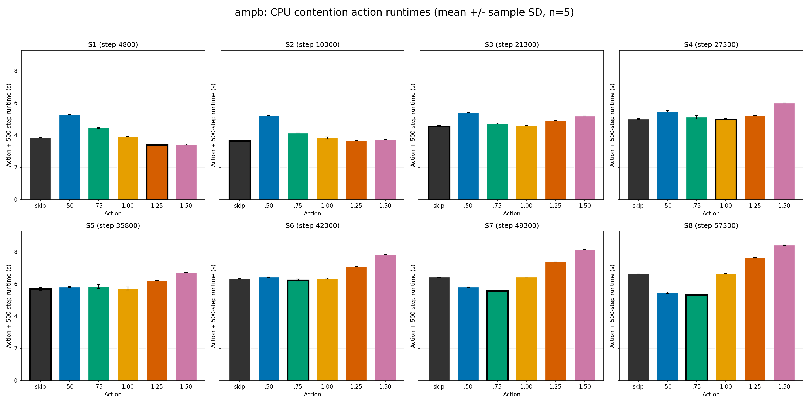
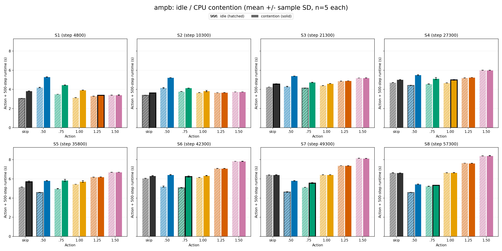
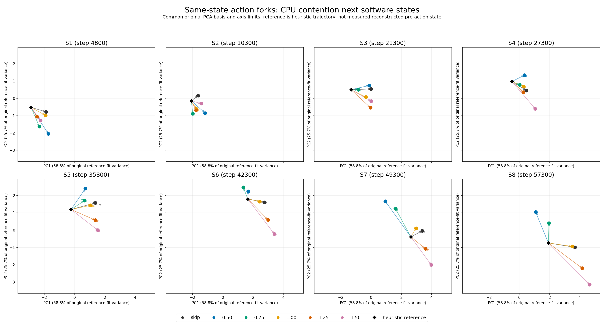
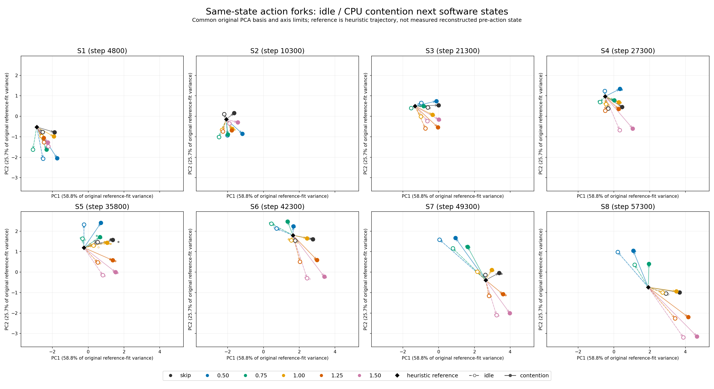
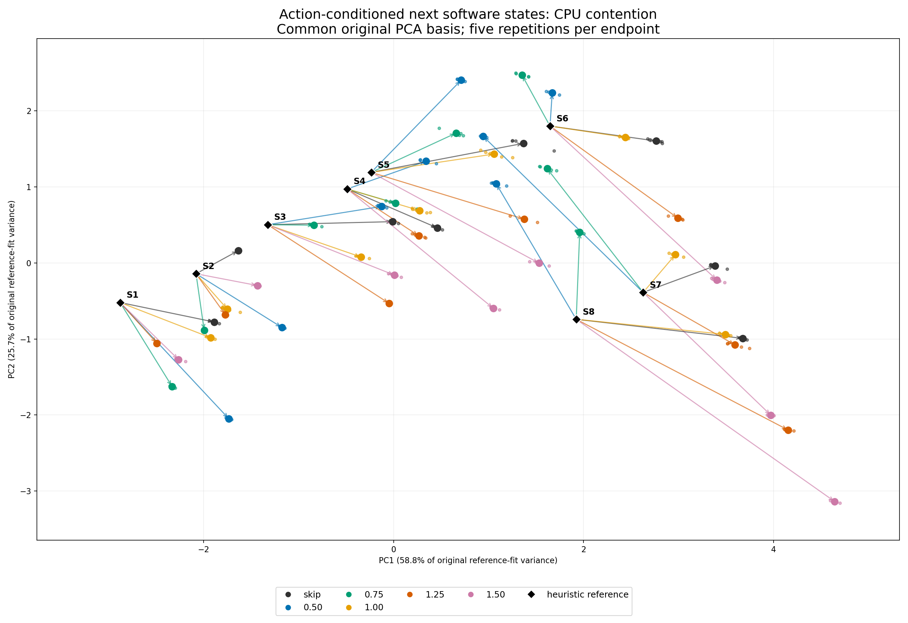
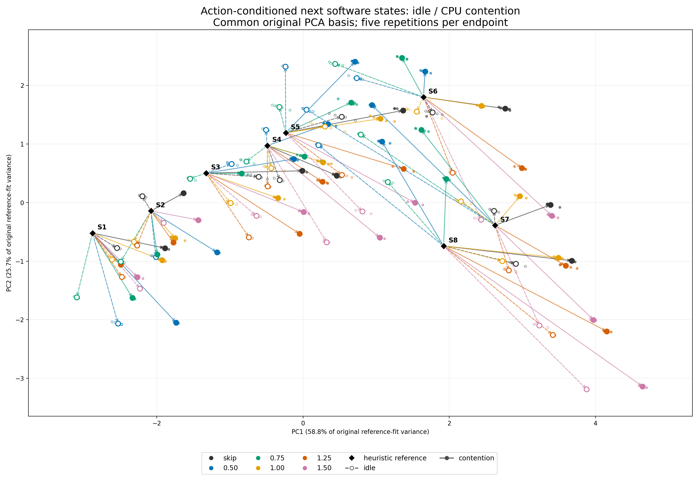

# 指定の3形式でのCPU contention比較

元の3枚はcontentionなしの初回240試行。以下の追加図は、完了したv3の480試行（idle240・contention240、各条件5回）から生成した。追加実験は行っていない。比較図のidleは元の240試行ではなく、contentionと同じv3実験内のidle測定である。

PCAは元の3枚と同じ6特徴・標準化・componentsを固定して使用する。各負荷条件で別々にPCAをfitしていない。新しい4枚のPCA図は同じ座標範囲を使う。軸の寄与率は元のfitデータに対する値であり、新しい負荷データの説明率ではない。

黒いdiamondと矢印始点は元の公式heuristic軌跡の参照状態。restart後に再構成した実際のpre-action rank統計は記録されていないため、矢印長を厳密な計測前後の変化量として解釈しない。contentionは計測中のみactive。

## Runtime

棒とerror barは5回のmean ± sample SD。黒枠は各負荷条件の平均最小action。比較図の斜線がidle、塗りつぶしがcontention。

## 状態別PCA

actionの色は元の図と共通。比較図は中空点・破線がidle、塗りつぶし点・実線がcontention。小さい点は5反復、大きい点は平均endpoint。

## 全体PCA

これらのPCAは不均衡3指標とPair/Neigh/Comm per-step時間を含む。不均衡3指標だけでは同じcheckpoint/actionの両負荷条件はログ精度で一致し、PCA図の差は時間を含む特徴に現れる。[数値結果](CONTENTION_V3.md)、[全5回のmatrix](CONTENTION_MATRIX_V3.md)を参照。日をまたいだ測定の時間変動を含む。

時間を除いた3不均衡指標だけの比較は[こちら](IMBALANCE_CONTENTION_PCA.md)。
