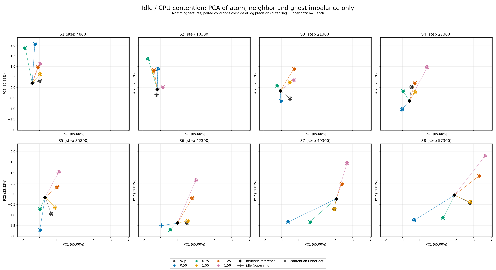
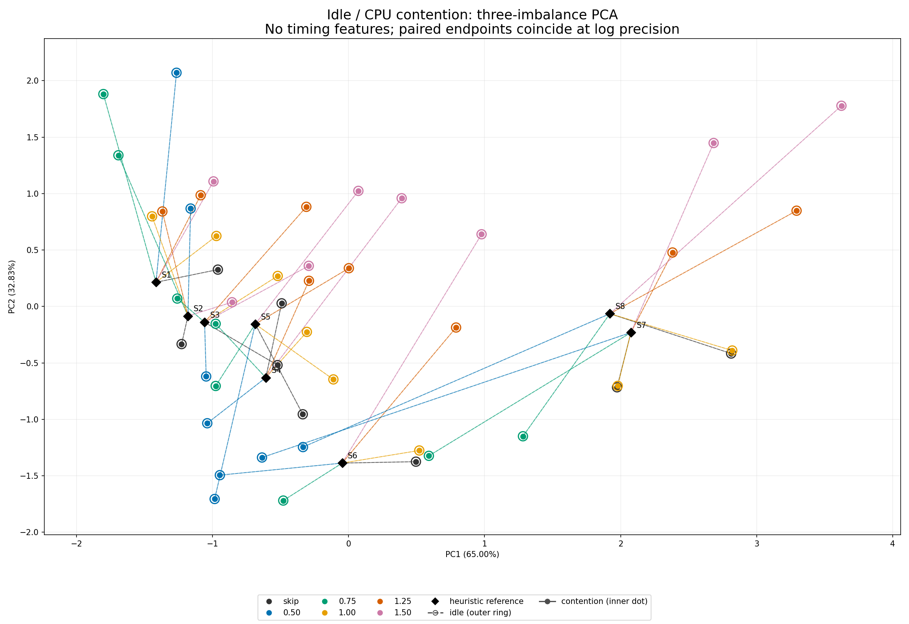

# 時間を除いた3不均衡指標のPCA比較

atom・neighbor・ghostのmax/meanだけを使用。8状態 × 6 actions × 各5反復のidle/contention（480試行）を比較する。追加実験はない。

idleの240終点を標準化してPCAをfitし、両条件を共通の変換で投影した。寄与率はPC1 64.9954%、PC2 32.8328%、合計97.8282%。

同一状態・action・反復での3特徴の最大絶対差は **0**。ログ精度では両条件の終点が一致する。外側の中空円がidle、内側の点がcontentionで、重なりが見えるようにサイズだけ変えている。座標のずらしはない。物理状態の厳密な同一性や未記録の差の不存在を示すものではない。

黒い菱形はheuristic軌跡の参照点。再構成直後のpre-action統計ではないため、線を厳密な前後の遷移量として解釈しない。

[標準化・係数・入力SHA-256](imbalance_contention_pca_metadata.json)
