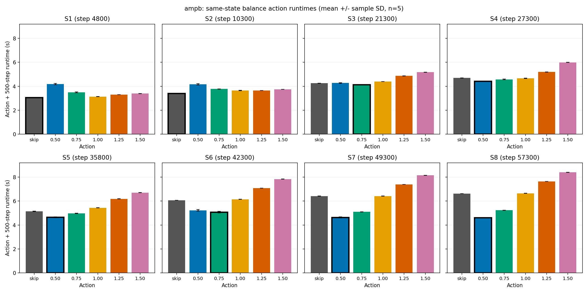
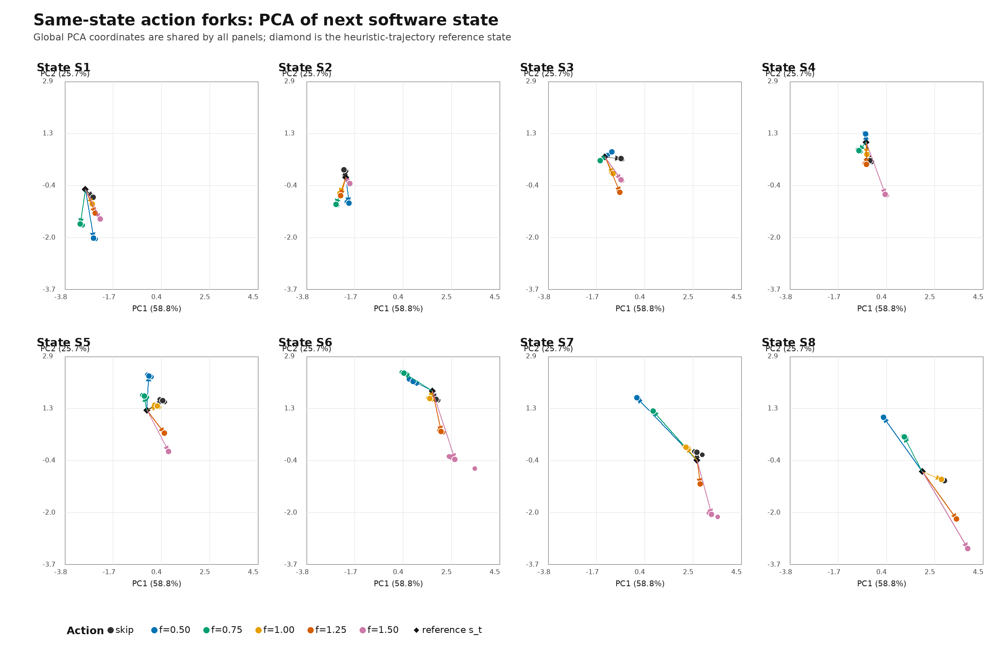
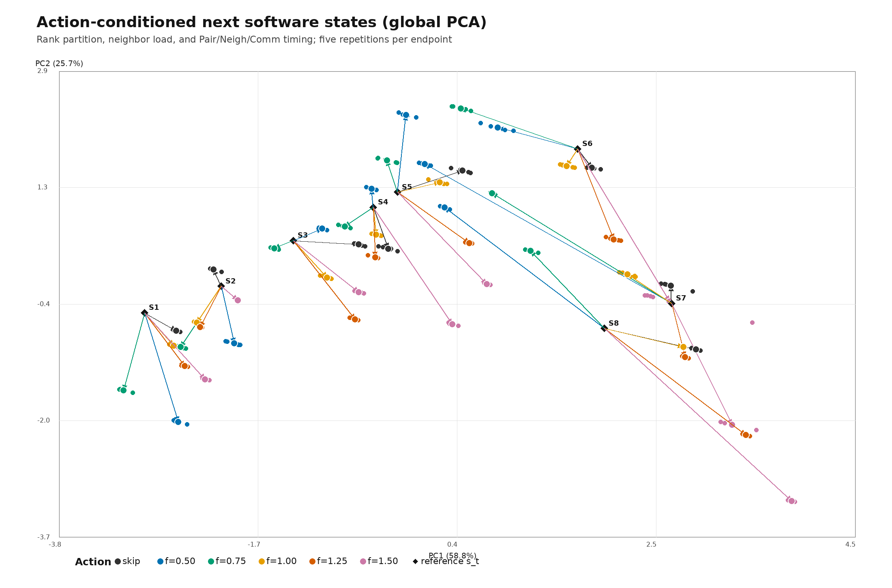

# 2026-10-08 ampb：Shock/NEMDの状態・行動・次状態遷移解析

## 掲載する図

掲載図は `phase_action_runtimes.png`、`state_action_pca_by_state.png`、`state_action_pca_global.png` の3枚に絞った。いずれも元のcontentionなし240試行の解析図。追加の不均衡のみ解析、2,500-step持続性、idle/contention比較の数値・表は各報告に保持し、その補助図は `rl_hpc/characterization/data/portable_reproduction_report_v1/supplementary_plots/` へ退避した。図の整理に際して追加実験は行っていない。ユーザー指定のcontentionあり3枚とidle比較3枚は、完了済みv3の480試行から作成し、[一覧](CONTENTION_PLOTS.md)に掲載した。

## 実験の位置づけ

ampb上で固定初期状態から実施した240件のstate × balance-action測定を、保存済みデータから解析した。安全性だけでなく、action後500 stepsの物理状態・MPI分割統計・timingがactionに依存するかを確認した。学習方策の性能評価ではない。

**500-step後のsoftware・MPI分割状態はactionによって変化した。物理観測量のaction間差は極めて小さく、densityは同じstate内の全30試行で一致した。2,500-step持続性実験も完了し、S3の比較pairで即時・累積順位の反転を確認した（[詳細](PERSISTENCE.md)）。**

- 解析・文書作成日：2026-10-08（Asia/Tokyo）。元測定は2026-10-07 JST。
- マシン：ampb.g2.gsic.titech.ac.jp。
- 測定branch：rl-hpc-research、基準commit：3be966cff1d738574264a1d89cd7c07b712de78a。
- 解析時checkout commit：`bae96b699e96efbdbe48facaaac452f2ee0f071c`（測定時commitとは区別）。
- 解析例：[2026-10-07 amp2](../2026-10-07_amp2/README.md)。提示された/work/...パスはこのホストでは存在せず、リポジトリ内の同名資料を参照した。

## 環境・build・workload

Intel Xeon 6972P ×2、192物理core、384論理CPU、NUMA6、メモリ約1.5 TiB。Ubuntu26.04.1、Linux7.0.0-38、GCC15.2.0、CMake4.2.3、Open MPI5.0.10、Python3.14.4、NumPy2.3.5。

Release、MPI/OMP ON、SHOCK/OPENMP ON、-march=native、-O3 -DNDEBUG、Unix Makefiles、build jobs16。既存portable buildに不足していたEXTRA-PAIR（lj/cubic）とEXTRA-COMPUTE（momentum）はユーザー承認で追加した。実験コード・既存スクリプトは未変更。

491,520原子、nx480/ny16/nz16、velocity seed47287、skin0.5、neighbor every1 delay0 check yes、MPI32/OMP1、1 interval500 MD steps。32 rankがsocket0の異なる32物理coreへbindされていることを確認した。専用利用の許可を得て実行し、oversubscribe・外部contention導入・LAMMPS試行並列化は行っていない。

## 状態・行動・報酬・遷移

物理状態：temperature、pressure、density、total energy per atom、shock位置。software状態：Nlocal/Nghost/Neighsのrank統計、atom/neighbor/ghost不均衡、neighbor build数。性能状態：Pair/Neigh/Comm/Modify時間とwall time。

不均衡は各rank統計の最大値/平均値。Neighsは粒子数ではなくneighbor entry数であり、atom不均衡だけで計算負荷の良否は判断できない。詳しい定義とMPI同期は[LAMMPS_STATE_AND_EXECUTION.md](LAMMPS_STATE_AND_EXECUTION.md)を参照。

actionはskipまたはbalance 1.0 shift x 10 1.0 weight neigh FACTOR、FACTOR={0.50,0.75,1.00,1.25,1.50}。rewardは準備・action適用と後続500-step runtimeの負値。binary restartは不均等MPI領域境界を保存しないため、各forkはtimer外でweight neigh1.0の共通pre-action partitionを再構成した。各stateの30試行で再構成後のpre-action thermoが完全一致した。

```text
同じcheckpoint → 共通partition再構成（timer外）
              → skip / balance(factor) → 500 MD steps → 次状態・reward
```

次状態の物理量は各logのOBS行から取り出した。MPI統計とtimingはmeasurements.jsonlのnext_state.lammpsを使用した。timingは500-step区間全体の平均rank時間であり、終了瞬間の状態量ではない。

## 状態採取と安全性

公式fix balance 500 1.2 shift x 10 1.1 weight neigh1.0で120 decision×3 episode、360 transitionsを採取した。episode時間628.308658/627.006023/626.623139秒、mean627.312607、sample std0.883594、CV0.140854%。既存medoid選定はstep/decision/shock位置を距離に含めず、観測featureから8状態を選んだ。

| State | Decision | Step | Atom不均衡 | Neighbor不均衡 | Pair秒/step |
|---:|---:|---:|---:|---:|---:|
| 1 | 7 | 4800 | 1.1123 | 1.3708 | 0.003440 |
| 2 | 18 | 10300 | 1.2703 | 1.3114 | 0.003868 |
| 3 | 40 | 21300 | 1.5831 | 1.3190 | 0.004689 |
| 4 | 52 | 27300 | 1.8792 | 1.2165 | 0.005148 |
| 5 | 69 | 35800 | 1.9407 | 1.2108 | 0.005775 |
| 6 | 82 | 42300 | 2.1052 | 1.0587 | 0.005678 |
| 7 | 96 | 49300 | 3.1946 | 1.1496 | 0.005048 |
| 8 | 112 | 57300 | 3.1905 | 1.1964 | 0.004341 |

状態smoke2 transitions、軌跡360 transitions、checkpoint8個、action smoke6試行、本測定240試行を正常完了。240 unique試行、48組合せ×各5反復、全return code0、atoms491520、step増分500、dangerous builds0、NaN/Inf・simulation errorなし、checkpoint SHA-256照合済み。各段階終了後の残留MPI/LAMMPSなし。

初回確認実行は不足packageで2回rc1となり、停止・承認後にbuild依存関係を解消した。これらを安全な本測定数に含めない。既存初期生成入力はcheck noのためdangerous builds not checkedであり、初期生成段階のdangerous build数を0とは主張しない。

## 即時runtime比較

各セルは5反復mean（秒）、stdはsample std、CV=std/mean。

| State | skip | 0.50 | 0.75 | 1.00 | 1.25 | 1.50 |
|---:|---:|---:|---:|---:|---:|---:|
| 1 | 3.061605 | 4.188682 | 3.500094 | 3.137863 | 3.299226 | 3.392489 |
| 2 | 3.401639 | 4.169261 | 3.774873 | 3.650797 | 3.649670 | 3.739862 |
| 3 | 4.254013 | 4.280515 | 4.132099 | 4.399194 | 4.872494 | 5.182889 |
| 4 | 4.700378 | 4.410519 | 4.571234 | 4.667345 | 5.196645 | 5.996444 |
| 5 | 5.149385 | 4.648625 | 4.975887 | 5.441850 | 6.190243 | 6.704673 |
| 6 | 6.066122 | 5.227290 | 5.072988 | 6.144288 | 7.086490 | 7.837529 |
| 7 | 6.412367 | 4.637247 | 5.103145 | 6.418568 | 7.389900 | 8.147954 |
| 8 | 6.621733 | 4.600745 | 5.232730 | 6.650230 | 7.635380 | 8.399766 |



同じ縦軸・0秒始点、error barはstd、黒枠は各stateの最小mean。

| State | Best | Mean(s) | Std(s) | CV | Runner-up | Gap |
|---:|---|---:|---:|---:|---|---:|
| 1 | skip | 3.061605 | 0.003325 | 0.11% | factor-1.00 | 2.49% |
| 2 | skip | 3.401639 | 0.003501 | 0.10% | factor-1.25 | 7.29% |
| 3 | factor-0.75 | 4.132099 | 0.004987 | 0.12% | skip | 2.95% |
| 4 | factor-0.50 | 4.410519 | 0.007410 | 0.17% | factor-0.75 | 3.64% |
| 5 | factor-0.50 | 4.648625 | 0.040199 | 0.86% | factor-0.75 | 7.04% |
| 6 | factor-0.75 | 5.072988 | 0.062967 | 1.24% | factor-0.50 | 3.04% |
| 7 | factor-0.50 | 4.637247 | 0.043548 | 0.94% | factor-0.75 | 10.05% |
| 8 | factor-0.50 | 4.600745 | 0.009602 | 0.21% | factor-0.75 | 13.74% |

Best Fixedはfactor0.50、8状態mean合計36.162884秒。記述的oracleは33.965468秒、差2.197416秒、改善6.08%。同じデータで選択・評価したoracleであり、学習方策の性能・不偏な汎化性能・連続軌跡の総時間ではない。

skip対0.50はS1でskipが1.127077秒速く、S8で0.50が2.020988秒速く、action reversalは観測ノイズより大きい。winner-runner差はS1/2/3/4/5/7/8で合成stdの5.48〜46.14倍。S6は1.61倍、観測rangeが重なるため証拠は弱いが、全5反復ブロックで0.75が0.50より速かった。独立追加検証は未実施。

## Actionによって次状態は変わるか

### 物理観測量

各stateの全6action×5反復についてOBS行のtemperature、pressure、density、energy per atom、shock位置を比較した。次表のrangeは全30試行のmax−min。

| State | Δtemperature | Δpressure | Δdensity | Δenergy/atom | Δshock位置 |
|---:|---:|---:|---:|---:|---:|
| 1 | 1.85934823094e-10 | 6.95166590958e-10 | 0 | 5.88329385209e-12 | 1.79980474968e-11 |
| 2 | 1.79255721378e-10 | 6.71320776746e-10 | 0 | 3.32534000336e-12 | 1.98951966013e-12 |
| 3 | 2.72535771728e-10 | 9.96237758955e-10 | 0 | 2.67164068646e-12 | 1.02318153949e-12 |
| 4 | 4.05918854085e-10 | 1.46303591464e-09 | 0 | 1.50919277075e-11 | 3.00133251585e-11 |
| 5 | 1.82109261004e-09 | 6.94365098752e-09 | 0 | 7.1054273576e-12 | 1.98951966013e-12 |
| 6 | 1.56997259637e-09 | 5.80087089475e-09 | 0 | 7.67386154621e-12 | 1.19939613796e-11 |
| 7 | 3.76843445338e-10 | 1.31024080474e-09 | 0 | 2.245315045e-12 | 1.70530256582e-11 |
| 8 | 8.75388650456e-11 | 3.35091954184e-10 | 0 | 1.93267624127e-12 | 3.06954461848e-12 |

densityのrangeは全stateで0だった。他の観測量は完全一致ではなく、最大rangeはtemperature 1.8211e-9、pressure 6.9437e-9、energy/atom 1.5092e-11、shock位置3.0013e-11だった（LJ単位）。対応する値の桁に比べて極めて小さく、数値的差と整合するが、原因を切り分けていない。全粒子座標・速度・力のbitwise一致を直接検証したものではない。balanceは領域分割を変える操作であり、このデータから物理モデルが変わったという証拠はない。

### MPI分割・負荷・性能の次状態

次表はaction後500 stepsの各state-action5反復mean。各metricのstd/CV/min/maxはGit管理外のnext_state_analysis.jsonに保存した。

| State | Action | Atom不均衡 | Neighbor不均衡 | Ghost不均衡 | Pair秒/step | Neigh秒/step | Comm秒/step | Builds |
|---:|---|---:|---:|---:|---:|---:|---:|---:|
| 1 | skip | 1.24134 | 1.36016 | 1.25064 | 0.0034560 | 0.0012912 | 0.0003913 | 50.0 |
| 1 | 0.50 | 1.19870 | 1.66664 | 1.32221 | 0.0034446 | 0.0012843 | 0.0005032 | 50.0 |
| 1 | 0.75 | 1.06725 | 1.67156 | 1.15789 | 0.0034464 | 0.0012887 | 0.0004463 | 50.0 |
| 1 | 1.00 | 1.27103 | 1.41168 | 1.26571 | 0.0034558 | 0.0012892 | 0.0003963 | 50.0 |
| 1 | 1.25 | 1.28158 | 1.48087 | 1.25606 | 0.0034577 | 0.0012920 | 0.0004530 | 50.0 |
| 1 | 1.50 | 1.34499 | 1.49742 | 1.28078 | 0.0034568 | 0.0012909 | 0.0004921 | 50.0 |
| 2 | skip | 1.26647 | 1.27668 | 1.08769 | 0.0038906 | 0.0014689 | 0.0004386 | 51.0 |
| 2 | 0.50 | 1.21315 | 1.46304 | 1.24054 | 0.0038540 | 0.0014546 | 0.0005242 | 51.0 |
| 2 | 0.75 | 1.15352 | 1.58007 | 1.11846 | 0.0038583 | 0.0014589 | 0.0004902 | 51.0 |
| 2 | 1.00 | 1.26165 | 1.47886 | 1.12015 | 0.0038900 | 0.0014680 | 0.0004682 | 51.0 |
| 2 | 1.25 | 1.36003 | 1.48646 | 1.11992 | 0.0038760 | 0.0014615 | 0.0004678 | 51.0 |
| 2 | 1.50 | 1.49831 | 1.32240 | 1.17960 | 0.0038714 | 0.0014659 | 0.0004526 | 51.0 |
| 3 | skip | 1.61230 | 1.21168 | 1.20829 | 0.0047028 | 0.0018336 | 0.0005523 | 54.0 |
| 3 | 0.50 | 1.27025 | 1.21516 | 1.12248 | 0.0046516 | 0.0018105 | 0.0005519 | 54.0 |
| 3 | 0.75 | 1.33815 | 1.35011 | 1.09223 | 0.0046579 | 0.0018178 | 0.0004871 | 54.0 |
| 3 | 1.00 | 1.66595 | 1.34403 | 1.26655 | 0.0047039 | 0.0018336 | 0.0004993 | 54.0 |
| 3 | 1.25 | 1.89421 | 1.44221 | 1.32652 | 0.0046939 | 0.0018383 | 0.0005538 | 54.0 |
| 3 | 1.50 | 2.14010 | 1.37280 | 1.20694 | 0.0046759 | 0.0018311 | 0.0005427 | 54.0 |
| 4 | skip | 1.82812 | 1.31350 | 1.20321 | 0.0051613 | 0.0019496 | 0.0005785 | 53.0 |
| 4 | 0.50 | 1.28542 | 1.14802 | 1.08145 | 0.0050993 | 0.0019273 | 0.0006027 | 53.0 |
| 4 | 0.75 | 1.46432 | 1.29897 | 1.13031 | 0.0051173 | 0.0019356 | 0.0005506 | 53.0 |
| 4 | 1.00 | 1.83314 | 1.25712 | 1.24253 | 0.0051530 | 0.0019489 | 0.0005122 | 53.0 |
| 4 | 1.25 | 2.17650 | 1.35365 | 1.18356 | 0.0051357 | 0.0019492 | 0.0005206 | 53.0 |
| 4 | 1.50 | 2.48223 | 1.43730 | 1.39498 | 0.0051369 | 0.0019484 | 0.0006261 | 53.0 |
| 5 | skip | 1.94388 | 1.14849 | 1.12872 | 0.0057780 | 0.0022312 | 0.0006089 | 55.0 |
| 5 | 0.50 | 1.28932 | 1.03446 | 1.03594 | 0.0057280 | 0.0022159 | 0.0005586 | 55.0 |
| 5 | 0.75 | 1.55879 | 1.21581 | 1.04910 | 0.0057422 | 0.0022168 | 0.0005385 | 55.0 |
| 5 | 1.00 | 2.08796 | 1.19013 | 1.19144 | 0.0057826 | 0.0022294 | 0.0005262 | 55.0 |
| 5 | 1.25 | 2.25579 | 1.35290 | 1.27167 | 0.0057885 | 0.0022362 | 0.0006106 | 55.0 |
| 5 | 1.50 | 2.37311 | 1.46685 | 1.32410 | 0.0057932 | 0.0022346 | 0.0006635 | 55.0 |
| 6 | skip | 2.34805 | 1.03895 | 1.25341 | 0.0055781 | 0.0032947 | 0.0006378 | 83.0 |
| 6 | 0.50 | 1.35397 | 1.07020 | 1.04911 | 0.0055326 | 0.0032770 | 0.0006421 | 83.0 |
| 6 | 0.75 | 1.87982 | 1.03147 | 1.02661 | 0.0055190 | 0.0032612 | 0.0004694 | 83.0 |
| 6 | 1.00 | 2.37135 | 1.05469 | 1.26410 | 0.0055838 | 0.0032957 | 0.0005738 | 83.0 |
| 6 | 1.25 | 2.61751 | 1.22682 | 1.38442 | 0.0055807 | 0.0032910 | 0.0006829 | 83.0 |
| 6 | 1.50 | 2.79889 | 1.35845 | 1.47109 | 0.0055584 | 0.0032933 | 0.0008187 | 83.0 |
| 7 | skip | 3.09460 | 1.07514 | 1.59857 | 0.0049530 | 0.0030304 | 0.0007120 | 83.0 |
| 7 | 0.50 | 1.73678 | 1.09663 | 1.05257 | 0.0049079 | 0.0030043 | 0.0005100 | 83.0 |
| 7 | 0.75 | 2.42305 | 1.04471 | 1.26806 | 0.0049186 | 0.0030148 | 0.0004767 | 83.0 |
| 7 | 1.00 | 3.09824 | 1.07704 | 1.60039 | 0.0049530 | 0.0030300 | 0.0006042 | 83.0 |
| 7 | 1.25 | 3.41543 | 1.25813 | 1.75338 | 0.0049446 | 0.0030270 | 0.0007201 | 83.0 |
| 7 | 1.50 | 3.66243 | 1.40819 | 1.87331 | 0.0049327 | 0.0030266 | 0.0008198 | 83.0 |
| 8 | skip | 3.38483 | 1.07419 | 1.82893 | 0.0042732 | 0.0033135 | 0.0006663 | 100.0 |
| 8 | 0.50 | 1.90579 | 1.09837 | 1.11372 | 0.0042542 | 0.0032847 | 0.0005280 | 100.0 |
| 8 | 0.75 | 2.66660 | 1.03226 | 1.44977 | 0.0042592 | 0.0032977 | 0.0004822 | 100.0 |
| 8 | 1.00 | 3.39297 | 1.07843 | 1.83170 | 0.0042784 | 0.0033144 | 0.0006337 | 100.0 |
| 8 | 1.25 | 3.73418 | 1.26466 | 2.00710 | 0.0042646 | 0.0033096 | 0.0007543 | 100.0 |
| 8 | 1.50 | 3.98704 | 1.40627 | 2.13096 | 0.0042508 | 0.0033034 | 0.0008467 | 100.0 |


曲線は各stateに独立forkした後の値であり、同じactionを連続適用した1本の軌跡ではない。

### action間差と反復ノイズ

action間range=max(action mean)−min(action mean)。pooled std=sqrt(6 actionのwithin-action sample varianceの平均)。以下はrange/pooled stdであり、正式な有意差検定ではない。

| State | Pair | Neigh | Comm |
|---:|---:|---:|---:|
| 1 | 7.82 | 9.51 | 11.63 |
| 2 | 15.16 | 21.71 | 8.69 |
| 3 | 15.27 | 30.58 | 6.57 |
| 4 | 12.31 | 32.62 | 9.47 |
| 5 | 12.53 | 19.15 | 8.60 |
| 6 | 6.90 | 7.22 | 7.08 |
| 7 | 7.32 | 14.91 | 16.29 |
| 8 | 10.36 | 24.01 | 45.02 |

atom_imbalanceの同一action内std最大値は0。

neighbor_imbalanceの同一action内std最大値は0。

ghost_imbalanceの同一action内std最大値は0。

S8ではatom不均衡が1.9058〜3.9870、neighbor不均衡が1.0323〜1.4063まで変化した。action名をstateへ記録したための自明な差ではなく、実測partition統計とtimingの差である。

## PCAによる遷移の可視化

既存plot_state_action_pca.pyを変更せず使用。atom/neighbor/ghost不均衡、Pair/Neigh/Comm秒/stepの6変数を標準化し、8参照state+240次stateの計248点で同じPCAをfitした。
PC1=58.80%、PC2=25.65%、累積=84.45%。





黒い菱形は元heuristic軌跡の参照stateであり、fork計測直前に再構成したpartitionのrank統計ではない。始点からの矢印長を厳密な状態変化量として解釈しない。色付き小点は5反復、白枠付き大点はaction別mean終点。action間の終点分離は実測値に基づく。PCAはRLの19次元state全体ではなく6変数部分空間である。

[係数・標準化・寄与率](state_action_pca_metadata.json)を保存。amp2とampbは別々にPCAをfitしたため、PCの符号や座標はサーバー間で直接比較できない。

## RLとの対応と持続性

workload・MPI/OMP・skin・500-step reward・skip/balanceの意味はhybrid-balance RLと対応する。今回のfactor5点はRLの連続factor範囲[0.5,1.5]の部分集合。RLのbalance履歴・経過decision数・subdomain幅などはPCAに含めていない。ghost不均衡はPCAには含むがRL方策入力には含まない。

checkpoint独立forkでは毎回partitionを再構成するが、persistent RL episodeでは前actionのpartitionを継承する。そのため即時action分岐結果をRL方策評価と同一視できない。

**ampbでも持続性実験を完了した。** 既存固定pair・7反復・70試行は全件安全。共通skip継続条件で後続区間にもaction効果が残り、S3の1.50対skipでは即時skip優位から2,500-step累積1.50優位へ反転した。[PERSISTENCE.md](PERSISTENCE.md)に全runtime、区間別不均衡、paired95% CI、amp2比較を記載した。比較pairはamp2由来。S1/S7/S8はampbのwinner/runner-upと一致するが、S3/S4は一致しない。全actionの有限horizon最適値やRL方策の優位性は未検証。

## amp2との比較・限界

| 項目 | amp2 | ampb |
|---|---|---|
| CPU | Xeon Gold6240R×2、48物理core | Xeon6972P×2、192物理core |
| メモリ | 768GB | 約1.5TiB |
| MPI/OMP | 32/1 | 32/1 |
| Best Fixed | skip / 52.4753秒 | 0.50 / 36.162884秒 |
| oracle | 50.6628秒 | 33.965468秒 |
| oracle改善率 | 3.45% | 6.08% |
| PCA2軸累積寄与率 | 78.77% | 84.45% |
| 500-step後software状態のaction依存性 | 確認 | 確認 |
| 2,500-step持続性・累積順位反転 | S4のpairで反転 | 既存pair70試行、S3のpairで反転 |

具体的なbest factorは一致しなかったが、状態依存runtimeとaction依存software次状態は両マシンで確認した。代表stepはamp2の4800/15300/20300/27300/32300/42300/48800/57800に対しampbは4800/10300/21300/27300/35800/42300/49300/57300で、選定観測にtimingを含むため同一ではない。Best Fixed合計31.09%短縮、oracle合計32.96%短縮は記述的比較であり、純粋なhardware speedupではない。

固定物理初期状態は1種類、公式heuristicが訪れる8状態、意図的contentionなし、各cell5反復、同データoracleという制約がある。checkpoint再生成と採取元軌跡はbitwise一致を保証せず、温度差最大絶対値0.126689だった。同一state内action比較は同じcheckpointと共通pre-action thermoを使用した。rank統計はLAMMPSログの表示精度で解析している。

## データ・再現・出典

- [完全な再現報告・240 runtime・全action mean/std/CV](../../../characterization/data/portable_reproduction_report_v1/REPORT.md)
- [次状態の全統計・物理range・noise比較JSON](../../../characterization/data/portable_reproduction_report_v1/next_state_analysis.json)
- [本測定JSONL](../../../characterization/data/portable_balance_forks_main_v1/measurements.jsonl)
- [既存runtime解析](../../../characterization/data/portable_balance_forks_main_v1/analysis.json)
- [8 checkpoint manifestとSHA-256](../../../characterization/data/portable_representative_checkpoints_v1/manifest.json)
- [portable手順](../shock_balance_hybrid/PORTABLE_REPRODUCTION.md)

既存PCA生成コマンド：

```bash
python3 rl_hpc/characterization/shock/plot_state_action_pca.py \
  --input rl_hpc/characterization/data/portable_balance_forks_main_v1 \
  --output-dir rl_hpc/docs/experiments/2026-10-08_ampb
```

runtime/next-state指標図と表は保存済み結果のpostprocessingで生成し、LAMMPSを追加実行していない。既存runtime描画スクリプトはamp2用の固定y軸下限4.3秒でampbの最小値3.06秒を扱えないため、スクリプト未変更のままMatplotlibで0秒始点の図を作成した。生データ・restart・log・binaryはGitへ追加していない。

## 全actionのruntime統計

各組合せn=5。Stdはsample std。

| State | Action | Mean(s) | Std(s) | CV |
|---:|---|---:|---:|---:|
| 1 | skip | 3.061605 | 0.003325 | 0.109% |
| 1 | factor-0.50 | 4.188682 | 0.050225 | 1.199% |
| 1 | factor-0.75 | 3.500094 | 0.042062 | 1.202% |
| 1 | factor-1.00 | 3.137863 | 0.007903 | 0.252% |
| 1 | factor-1.25 | 3.299226 | 0.004035 | 0.122% |
| 1 | factor-1.50 | 3.392489 | 0.006008 | 0.177% |
| 2 | skip | 3.401639 | 0.003501 | 0.103% |
| 2 | factor-0.50 | 4.169261 | 0.055012 | 1.319% |
| 2 | factor-0.75 | 3.774873 | 0.006380 | 0.169% |
| 2 | factor-1.00 | 3.650797 | 0.013509 | 0.370% |
| 2 | factor-1.25 | 3.649670 | 0.004079 | 0.112% |
| 2 | factor-1.50 | 3.739862 | 0.001491 | 0.040% |
| 3 | skip | 4.254013 | 0.016636 | 0.391% |
| 3 | factor-0.50 | 4.280515 | 0.029500 | 0.689% |
| 3 | factor-0.75 | 4.132099 | 0.004987 | 0.121% |
| 3 | factor-1.00 | 4.399194 | 0.007981 | 0.181% |
| 3 | factor-1.25 | 4.872494 | 0.005238 | 0.107% |
| 3 | factor-1.50 | 5.182889 | 0.009175 | 0.177% |
| 4 | skip | 4.700378 | 0.013433 | 0.286% |
| 4 | factor-0.50 | 4.410519 | 0.007410 | 0.168% |
| 4 | factor-0.75 | 4.571234 | 0.028376 | 0.621% |
| 4 | factor-1.00 | 4.667345 | 0.015190 | 0.325% |
| 4 | factor-1.25 | 5.196645 | 0.006295 | 0.121% |
| 4 | factor-1.50 | 5.996444 | 0.004065 | 0.068% |
| 5 | skip | 5.149385 | 0.013731 | 0.267% |
| 5 | factor-0.50 | 4.648625 | 0.040199 | 0.865% |
| 5 | factor-0.75 | 4.975887 | 0.017501 | 0.352% |
| 5 | factor-1.00 | 5.441850 | 0.007573 | 0.139% |
| 5 | factor-1.25 | 6.190243 | 0.016713 | 0.270% |
| 5 | factor-1.50 | 6.704673 | 0.007958 | 0.119% |
| 6 | skip | 6.066122 | 0.007632 | 0.126% |
| 6 | factor-0.50 | 5.227290 | 0.072192 | 1.381% |
| 6 | factor-0.75 | 5.072988 | 0.062967 | 1.241% |
| 6 | factor-1.00 | 6.144288 | 0.008461 | 0.138% |
| 6 | factor-1.25 | 7.086490 | 0.004685 | 0.066% |
| 6 | factor-1.50 | 7.837529 | 0.015405 | 0.197% |
| 7 | skip | 6.412367 | 0.009900 | 0.154% |
| 7 | factor-0.50 | 4.637247 | 0.043548 | 0.939% |
| 7 | factor-0.75 | 5.103145 | 0.008248 | 0.162% |
| 7 | factor-1.00 | 6.418568 | 0.010741 | 0.167% |
| 7 | factor-1.25 | 7.389900 | 0.005360 | 0.073% |
| 7 | factor-1.50 | 8.147954 | 0.010974 | 0.135% |
| 8 | skip | 6.621733 | 0.006195 | 0.094% |
| 8 | factor-0.50 | 4.600745 | 0.009602 | 0.209% |
| 8 | factor-0.75 | 5.232730 | 0.016766 | 0.320% |
| 8 | factor-1.00 | 6.650230 | 0.011822 | 0.178% |
| 8 | factor-1.25 | 7.635380 | 0.005065 | 0.066% |
| 8 | factor-1.50 | 8.399766 | 0.007607 | 0.091% |

入力measurements.jsonl SHA-256：`93d106bb1d8c1c87f6a23a4dbe40ef67c228f4ebe1350664b507b8c28b782f2a`。

## 不均衡だけを使った状態遷移解析

従来図のPC1/PC2はatom・neighbor・ghost不均衡とPair/Neigh/Comm時間を標準化して合成した軸であり、個別の物理状態量ではない。PC1は58.80%、PC2は25.65%を説明する。従来PC1はatom/ghost不均衡・Neigh/Comm時間と正、neighbor不均衡と負の係数を持つ。PC2はPair時間と正、neighbor/ghost不均衡と負の係数を持つ。PCA軸の符号は任意であり、因果的な意味や単独の負荷指標とは解釈しない。

今回、保存済み240件だけから、atom・neighbor・ghostのmax/meanの3変数を使用したPCAを追加した。timing、runtime、factor、step、shock位置は含めていない。各変数を8参照状態＋240終点で標準化し、既存PCA関数でSVDを行った。

不均衡のみのPC1は65.10%、PC2は32.72%、累積寄与率は97.82%。以下の式のzは各不均衡の標準化値である。

- PC1 = +0.70345 z(atom) -0.26026 z(neighbor) +0.66138 z(ghost)
- PC2 = +0.02310 z(atom) +0.93842 z(neighbor) +0.34471 z(ghost)


退避した補助図では横軸をatom不均衡、縦軸をneighbor不均衡とした。PCAを使用せず、両軸ともrank最大値/平均値。ghost不均衡はこの2次元表示には含まれない。


各色の終点はaction適用後500 stepsの実測rank統計で、同じactionの5反復はログ精度で一致するため点が重なる。黒い菱形はheuristic軌跡の参照状態であり、再構成直後のrank統計を記録していないので、矢印を厳密なpre-action→next-state変化量とは解釈しない。action間の終点分離は確認できる。追加LAMMPS実験は実施していない。

[不均衡のみPCAの係数・標準化・入力SHA-256](imbalance_only_pca_metadata.json)。

## CPU contentionによる条件付き次状態・報酬比較

最終v3は480試行（idle/contentionそれぞれ各条件5回）が安全に完了した。[最終結果](CONTENTION_V3.md)、[完全matrix](CONTENTION_MATRIX_V3.md)、[指定形式の6枚の図](CONTENTION_PLOTS.md)を参照。途中停止した旧測定の履歴は[CONTENTION.md](CONTENTION.md)に保持した。
