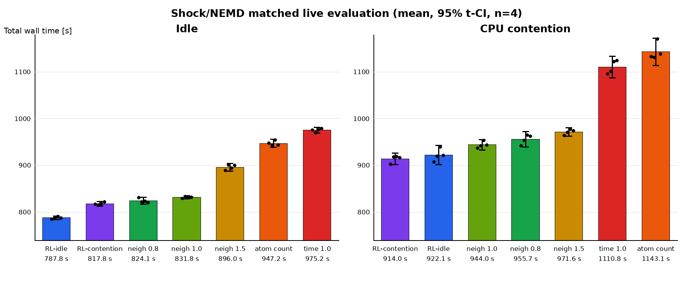

# Shock/NEMD: RL 方策と公式 balance ヒューリスティックの比較

## 目的

凍結済みの RL 方策 2 種類と、LAMMPS の `fix balance` が提供する公式の
負荷評価方式 A--D を、同じ Shock/NEMD 評価条件で比較した。
評価中の方策更新および探索は行っていない。

## 比較した方策

| 表記 | 方策 |
|---|---|
| RL-idle | 外部 CPU 負荷なしで学習した凍結済み方策 |
| RL-contention | CPU contention 下で学習した凍結済み方策 |
| A-atoms | `fix balance 500 1.2 shift x 10 1.1` |
| N08-neigh0.8 | A に `weight neigh 0.8` を追加 |
| B-neigh1.0 | A に `weight neigh 1.0` を追加 |
| C-neigh1.5 | A に `weight neigh 1.5` を追加 |
| D-time1.0 | A に `weight time 1.0` を追加 |

RL の action は、各 decision で balance を skip するか、数値的な
`weight neigh` factor を選ぶ hybrid action である。A--D は episode 中に
方式を切り替えない公式ヒューリスティックである。

## 評価条件

- MPI 32 ranks、OpenMP 1 thread/rank
- 491,520 atoms
- 500 MD steps/decision、120 decisions/episode（合計 60,000 MD steps）
- 未学習の物理 seed: 47287、57287
- 各 seed を 2 回反復し、各 regime・方策につき `n=4`
- regime: idle、CPU contention（CPU cores 0--7）
- RL 再評価には A--D と同一の contention schedule seed を使用
- 共通初期化: neighbor factor 1.5 による初期 balance と 50-step warm-up
- 指標: action 適用時間を含む 120 区間の総 wall time

## 結果

値は総 wall time の平均 ± sample standard deviation であり、小さい方が良い。

| 順位 | idle | 時間 [s] | CPU contention | 時間 [s] |
|---:|---|---:|---|---:|
| 1 | RL-idle | 787.784 ± 2.169 | RL-contention | 913.976 ± 7.598 |
| 2 | RL-contention | 817.844 ± 2.960 | RL-idle | 922.112 ± 13.030 |
| 3 | N08-neigh0.8 | 824.130 ± 4.756 | B-neigh1.0 | 944.029 ± 7.072 |
| 4 | B-neigh1.0 | 831.839 ± 1.924 | N08-neigh0.8 | 955.671 ± 10.316 |
| 5 | C-neigh1.5 | 895.980 ± 5.289 | C-neigh1.5 | 971.585 ± 5.503 |
| 6 | A-atoms | 947.193 ± 5.305 | D-time1.0 | 1110.758 ± 14.430 |
| 7 | D-time1.0 | 975.228 ± 3.817 | A-atoms | 1143.080 ± 18.418 |

### 最良 RL と最良公式ヒューリスティックの差

対応単位は `(physical seed, repeat)` である。95% CI は 4 組の対応差に
対する t 区間である。

| regime | 比較 | 平均差（heuristic − RL） | 95% paired CI | RL の短縮率 |
|---|---|---:|---:|---:|
| idle | N08-neigh0.8 − RL-idle | +36.346 s | [+26.286, +46.405] s | 4.41% |
| CPU contention | B-neigh1.0 − RL-contention | +30.053 s | [+20.953, +39.154] s | 3.18% |

ここで短縮率は `(T_heuristic - T_RL) / T_heuristic` とした。

### Neighbor factor 0.8 と 1.0

| regime | 0.8 [s] | 1.0 [s] | 対応差（0.8 − 1.0） | 95% paired CI |
|---|---:|---:|---:|---:|
| idle | 824.130 ± 4.756 | 831.839 ± 1.924 | -7.709 s | [-17.983, +2.566] s |
| CPU contention | 955.671 ± 10.316 | 944.029 ± 7.072 | +11.642 s | [+2.812, +20.471] s |

平均順位は idle で factor 0.8、CPU contention で factor 1.0 が良く、
外部負荷による候補最適値の反転が観測された。ただし idle の対応差の95%区間は
0を跨ぐため、idle で 0.8 が 1.0 より優れること自体は今回の `n=4` では未確定で
ある。CPU contention 下で 1.0 が 0.8 より速い差は0を跨がない。

### 2つの RL 方策の差

| regime | 比較 | 平均差 | 95% paired CI | 解釈 |
|---|---|---:|---:|---|
| idle | RL-contention − RL-idle | +30.060 s | [+24.227, +35.892] s | RL-idle が明確に速い |
| CPU contention | RL-idle − RL-contention | +8.136 s | [-5.264, +21.536] s | 平均は RL-contention が速いが未確定 |

したがって、idle では学習環境に合った RL 方策の優位性が確認できる。
CPU contention 下では順位は逆転したものの、RL 同士の差は今回の `n=4`
では測定変動から分離できない。

## 両環境を同じ重みで評価した場合

idle と CPU contention の平均を同じ重みで取った記述的な総合値は次の通りで
ある。この値は実運用時の負荷出現確率を表すものではない。

| 方策 | 2環境の平均 [s] |
|---|---:|
| RL-idle | 854.948 |
| RL-contention | 865.910 |
| neighbor 1.0 | 887.934 |
| neighbor 0.8 | 889.900 |
| neighbor 1.5 | 933.783 |
| time 1.0 | 1042.993 |
| atom count | 1045.136 |

負荷状態を既知として環境ごとに良い方策を選ぶ記述的なoracleは、RLでは
`RL-idle / RL-contention` を切り替えて 850.880 s、公式方式では
`neighbor 0.8 / neighbor 1.0` を切り替えて 884.079 s となる。RLで単一の
RL-idleを使う場合との差は約0.48%に留まり、負荷別RL切替の価値は現時点では
小さく統計的にも未確定である。

## Actionの実態

全4 episode、計480 decisionを合算すると、RL-idleのbalance選択率は
idle 96.46%、CPU contention 96.67%、平均選択factorはそれぞれ0.975、0.974
だった。RL-contentionはbalance選択率94.79%、94.38%、平均factorは1.246、
1.240だった。したがって両RLの差は主にskip頻度ではなく、選択するneighbor
factorの違いとして現れている。

公式方式でも、`fix balance`が実際に再分割iterationを行った割合は97.5--100%
だった。このShock/NEMDでは不均衡が継続的に大きいため、balanceするか否か
よりも、どの負荷指標・factorで分割するかが主要な比較軸になっている。

## 安全性

- 完了: 56/56 episode（RL 16、A--D 32、neighbor 0.8 は 8）
- non-zero exit: 0
- dangerous neighbor builds: 0
- 各 episode の終端 step: 61,300

## 結論と制約

今回の範囲では、数値 factor と skip を状態に応じて選ぶ RL 方策は、最良の
固定公式ヒューリスティックを idle で 4.41%、CPU contention 下で 3.18%
上回った。差は対応差の95%区間でも0を跨がない。

ただし `n=4` は小さく、A--D と RL は同じ初期状態・schedule ではあるが、
同時刻に交互実行した測定ではない。この結果は「RL 一般の優位性」ではなく、
この workload、action 空間、学習済み方策および amp2 上の評価に限定される。
特に CPU contention 用 RL が idle 用 RL より優れるという主張には、追加反復が
必要である。

## データ

- RL: `rl_hpc/characterization/data/shock_balance_rl_eval_matched_official_v2/run/`
- A--D: `rl_hpc/characterization/data/shock_official_balance_eval_main_v2/`
- neighbor 0.8: `rl_hpc/characterization/data/shock_official_neigh_08_eval_v1/`
- 集計表: `rl_hpc/docs/experiments/2026-10-09_amp2/rl_vs_official_summary.csv`
- action統計: `rl_hpc/docs/experiments/2026-10-09_amp2/rl_vs_official_action_stats.csv`
