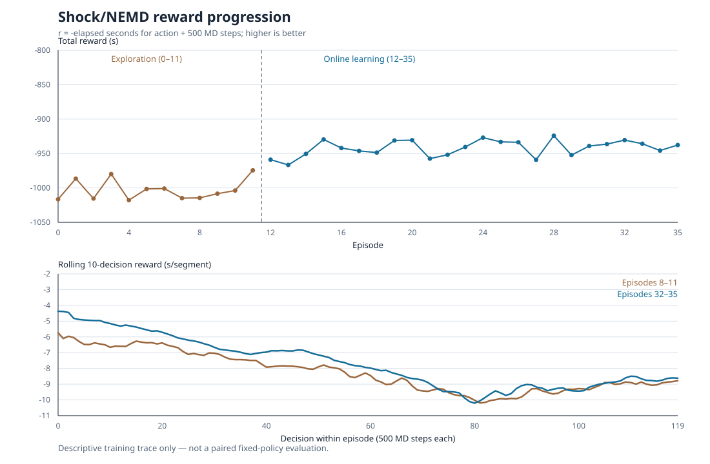
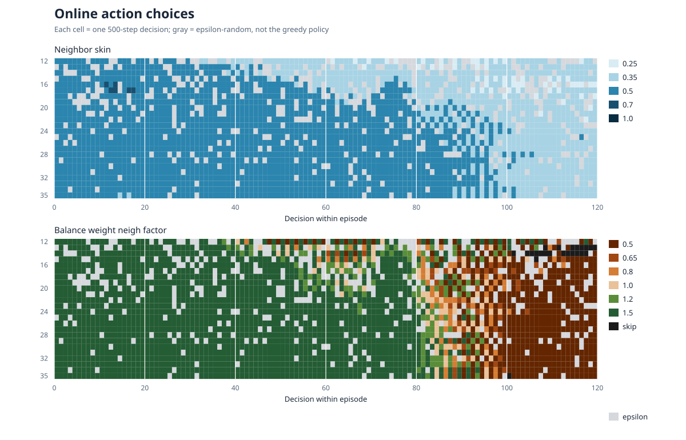

# Shock/NEMD online learning with controlled CPU contention

Status: collection complete. All 36 episodes and 4,320 transitions finished;
the dataset audit passed with no partial episodes or dangerous neighbour
builds. Data are in the ignored
`rl_hpc/characterization/data/shock_online_cpu_jitter_main_v1/` directory.
The run began on 2026-10-02 at 11:41 JST. This is a training trace, not a
paired frozen-policy evaluation.

## Reward and action plots





The last four exploration episodes average -1000.27 s total reward versus
-937.43 s for the last four learning episodes (120 decisions each). Higher
reward means less measured time. These groups share physical restart seeds,
but differ in selected actions and contention schedules; the difference
cannot by itself establish policy improvement. The reward plot's lower panel
is descriptive for the same reason. The action plot shows exploration
choices in gray and increasing concentration on a few actions, not a
state-conditioned policy validation. The audit counted 145 model updates.
The controlled worker consumed about 72.25 CPU-s per active interval and
0.11 CPU-s per inactive interval. Mean rewards were -9.03 and -7.01 s per
interval respectively, without adjustment for action and shock state.

## Matched learning budget

The idle and CPU-jitter studies each use 36 episodes, 12 stratified exploration
episodes followed by 24 online-learning episodes, four identical training
physical restarts in the same order, 120 decisions per episode, 500 MD steps
per decision, MPI 32, OpenMP 1, the same 35 safe actions, and the same FQI
hyperparameters (`gamma=0.95`, ridge 100, update every 20 transitions).
The two held-out restart seeds remain unused for training. The CPU study
changes only the external load protocol and the logging of that load; the
policy feature vector remains `shock-online-linear-v2` for comparability.

## Controlled load

`mpirun --report-bindings -np 32` verified MPI ranks 0--31 mapped to physical
cores 0--31. The co-runner pins one deterministic compute worker to each of
physical CPUs 0--7, deliberately sharing cores with eight LAMMPS ranks. It
does not use extra GPUs, global CPU-frequency controls, privileged scheduling,
or machine-wide settings. The worker group is started once per episode and
is switched between fully busy and sleeping states **only at decision
boundaries**. Active and inactive durations alternate, each lasting a
random 2--5 decision intervals. The schedule seed is deterministic and stored
per episode; it is **not** a policy feature.

The policy still observes its previous LAMMPS segment and the current
configuration, but does not directly receive the new co-runner state when it
changes at a boundary. Therefore the first action after a switch may be based
on stale application telemetry. The experiment tests adaptation under this
partial observability, not a controller with perfect contention detection.
Host load and per-core CPU utilization are logged separately for analysis.

Every transition additionally records the ground-truth on/off state,
co-runner CPU seconds during the measured interval, affected core IDs and
pre-decision core utilization. These fields are analysis-only. Reward remains
negative wall seconds for action application plus the next 500 MD steps;
co-runner-switching and telemetry-sampling overhead are outside reward.

## Smoke and safety

A two-episode/four-decision smoke completed all eight transitions with no
dangerous builds. Mean co-runner CPU use was 50.63 CPU-s per active segment
versus 0.07 CPU-s per inactive segment, confirming effective on/off control.
The active and inactive segment wall means (6.33 and 4.53 s) are **not** a
causal slowdown estimate because their actions and shock states differ.
Workers are terminated in an episode `finally` block; the user service's
control group also contains all children if the service is stopped.

## Monitoring and later analysis

```bash
systemctl --user status lammps-shock-online-cpu-jitter-v1.service
journalctl --user -u lammps-shock-online-cpu-jitter-v1.service -f
python3 rl_hpc/characterization/shock/analyze_online.py \
  rl_hpc/characterization/data/shock_online_cpu_jitter_main_v1
```

Do not run another MPI32 benchmark on this node during collection. Compare
training traces only descriptively: contention schedules differ by episode,
and neither trace is a paired fixed-policy evaluation. A reliable comparison
will require frozen idle-trained and jitter-trained policies, a strong fixed
baseline, identical held-out physical restarts and contention schedules, and
repeated live episodes with no online gradient/model updates.
